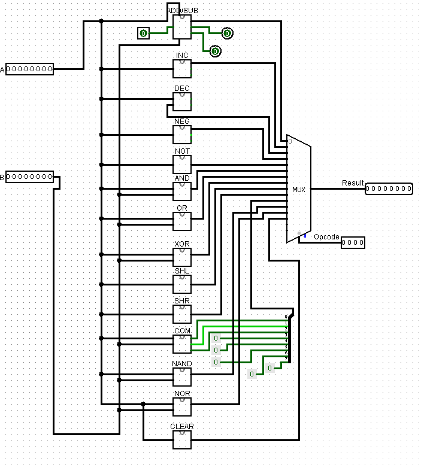
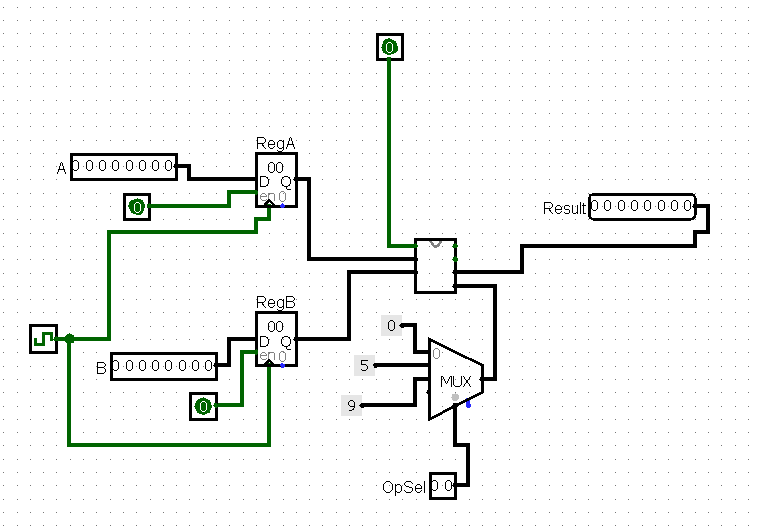
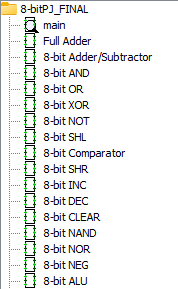

This project implements a custom 8-bit ALU and CPU designed in Logisim. Included is a modular ALU, 14-instruction operation set,
an opcode table, and example pseudo-assembly programs that demonstrate the instruction usage.

Featured are:
* Fully functioning 8-bit ALU
* Modular design. Instructions include ADD, SUB, COMPARATOR, SHIFT RIGHT, SHIFT LEFT, CLEAR, etc.
* Opcode table documenting all operations
* Example pseudo-assembly programs showcasing instruction behavior

## 🖼 Screenshots

### ALU

### CPU Overview

### Circuits Overview

